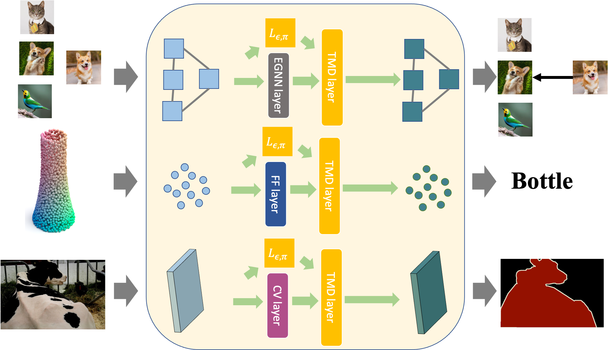

# neural-tmd-layer
This repository contains the reference code for our paper [Neural TMDlayer: Modeling Instantaneous flow of features via SDE Generators](https://openaccess.thecvf.com/content/ICCV2021/papers/Meng_Neural_TMDlayer_Modeling_Instantaneous_Flow_of_Features_via_SDE_Generators_ICCV_2021_paper.pdf) (ICCV-2021 **oral**)

<p align="center">
  
</p>
Our proposed TMDlayer models the stochastic flow of features, and in principle, can be added on top of any DNN layer to bring the benefits. In addition, it immediately enables doing transductive inference after added into the DNN model.


To have a quick and easy understanding of our TMDlayer, you can take a look at our video on youtube: [https://www.youtube.com/watch?v=vR3nrYJqcgQ](https://www.youtube.com/watch?v=vR3nrYJqcgQ)


## Requirements
* Python 3
* Pytorch 1.5+

## Use TMDlayer to replace Self-attention layer in point cloud transformer ([PCT](https://github.com/zihangm/PCT_Pytorch)):
```python
cd ./PCT_Pytorch
```
Follow the instructions in ./PCT_Pytorch to prepare the data and conduct training/testing using the PCT model with our TMDlayer inserted.

The replacement happens in **./PCT_Pytorch/model.py**


## Use TMDlayer in few-shot learning ([EGNN](https://github.com/zihangm/fewshot-egnn))
```python
cd ./fewshot-egnn
```
Follow the instructions in ./fewshot-egnn to prepare the data and conduct training/testing using our TMDlayer on top of the EGNN model.

Our TMDlayer is added in **./fewshot-egnn/model.py**


## Use TMDlayer in pygcn ([PYGCN](https://github.com/shubham745/pygcn))
```python
cd ./pygcn
python train.py
```

Follow the instructions in ./pygcn to prepare the data and conduct training/testing using our TMDlayer on top of the GCN model.

Our TMDlayer is added in **./pygcn/models.py**

[Link to Results](https://drive.google.com/file/d/1XLXUS1EkZfNxpdG_Jtd-1DER7NG0WHEc/view?usp=sharing)


## Use TMDlayer in  long-tailed recognition ([LongTail](https://github.com/shubham745/LTR-weight-balancing/))
```python
cd ./LTR-weight-balancing
```

Follow the instructions in ./LTR-weight-balancingto prepare the data and conduct training/testing using our TMDlayer.

Our TMDlayer is added in **./LTR-weight-balancing/utils/network_arch_resnet.py**

We show examples of using this in **./LTR-weight-balancing/demo1_first-stage-training.ipynb** and **./LTR-weight-balancing/demo2_second-stage-training.ipynb**

[Link to Results](https://drive.google.com/file/d/1XLXUS1EkZfNxpdG_Jtd-1DER7NG0WHEc/view?usp=sharing)


## Use TMDlayer in FashionMNIST ([FashionMNIST](https://colab.research.google.com/drive/1PHb1PcfTMIZXCeJVxTMiPAQH285Pae3f?usp=sharing))

See TMD_FashionMNIST.ipynb


[Link to Results](https://drive.google.com/file/d/1XLXUS1EkZfNxpdG_Jtd-1DER7NG0WHEc/view?usp=sharing)

## Reference
If you find our work useful, please consider citing our paper.
```
@inproceedings{meng2021neural,
  title={Neural TMDlayer: Modeling Instantaneous flow of features via SDE Generators},
  author={Meng, Zihang and Singh, Vikas and Ravi, Sathya N},
  booktitle={Proceedings of the IEEE/CVF International Conference on Computer Vision},
  pages={11635--11644},
  year={2021}
}
```
